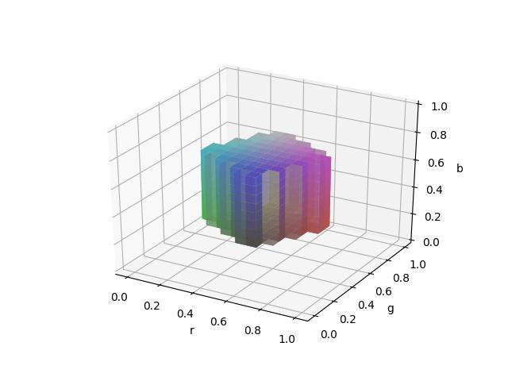
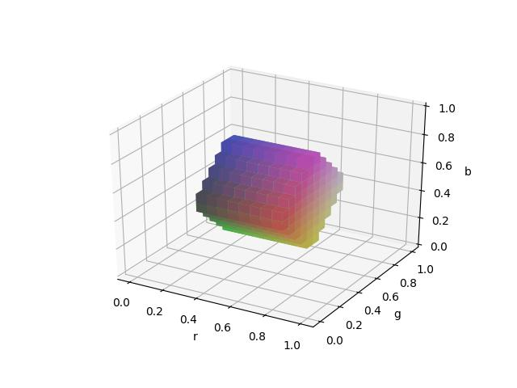
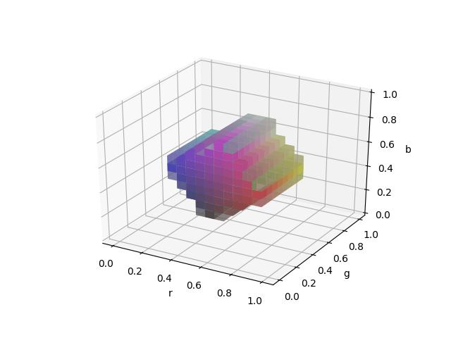
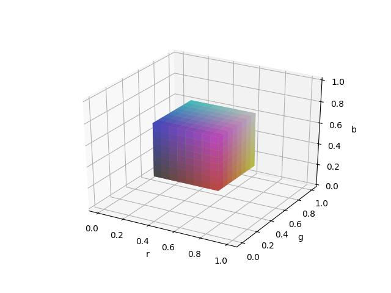
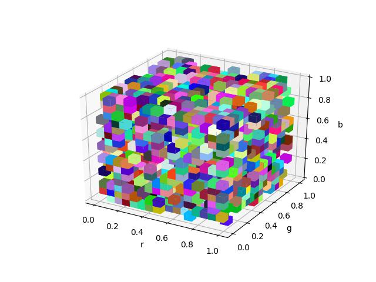
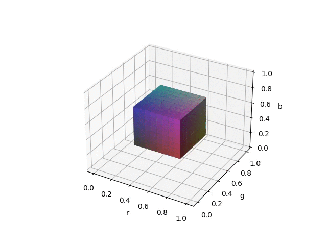
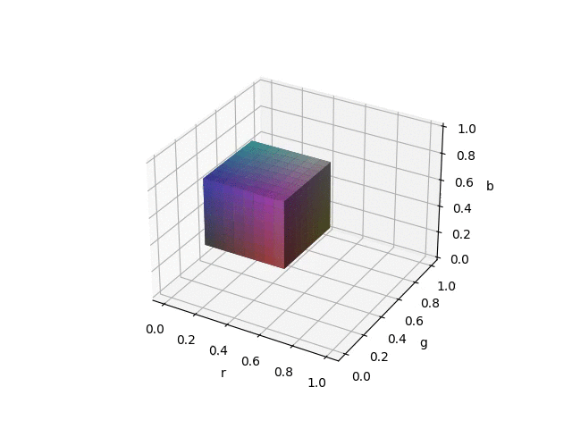
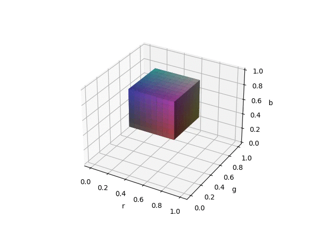
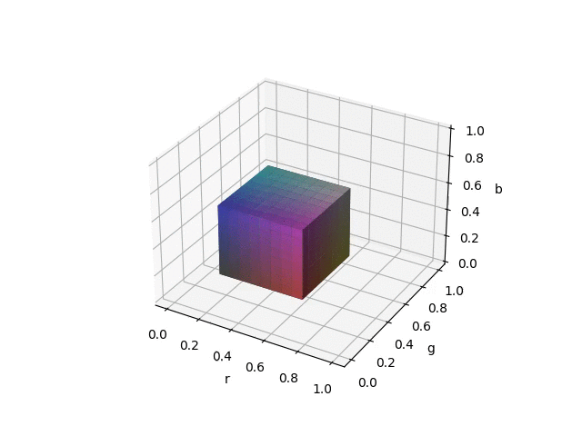

# PyTorch Feature Volume Rotator


[This function](pytorch_volume_rotator.py) uses trilinear interpolation to rotate and translate feature volumes.
Because the function is written entirely in PyTorch, it can be seamlessly plugged into a deep learning training pipeline.
As a toy example, given the following output feature volumes:

<p align="center">
  
  
  
</p>

and the associated rotations that produced them, the true input feature volume (left) can be recovered from a randomly initialized feature volume (right):

<p align="center">
  
  
</p>

```bash
python3 optimize_example.py
```

## Examples

```bash
python3 rotation_translation_example.py rotate
```

produces these:

<p align="center">
  
  
  
</p>

```bash
python3 rotation_translation_example.py translate
```

produces these:

<p align="center">
  
  
  
</p>
